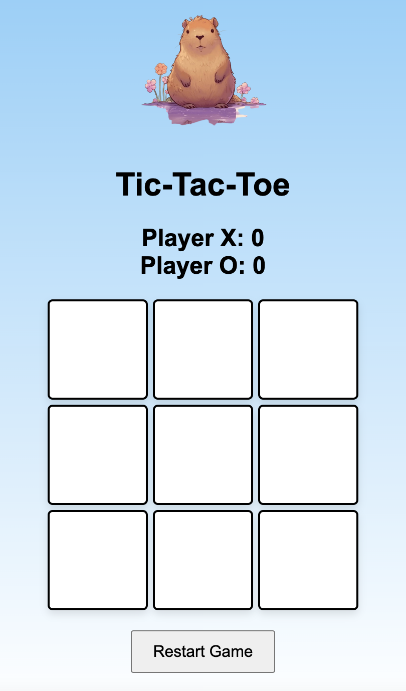
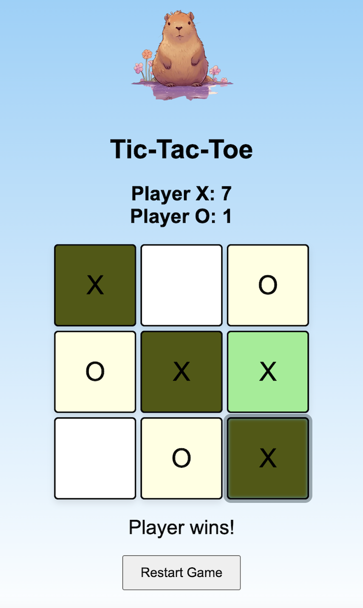
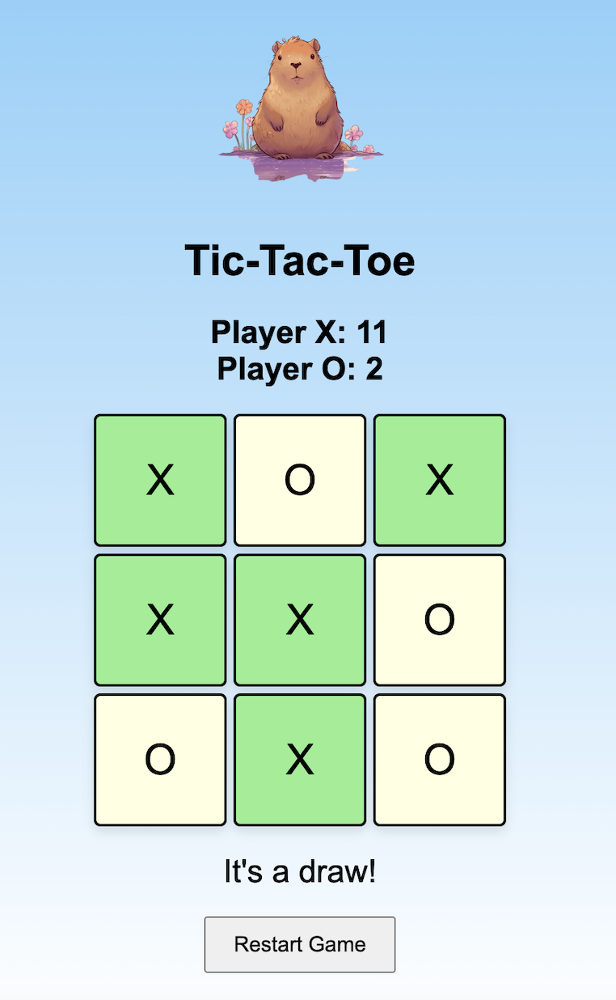

Github Repository Link
[Github Repository Link](https://github.com/kyu065/yatzy)

How The Game Works
Try to connect three x in a row before your opponent does. Players may place their respective x or o in any space not yet taken by another player.

Game States
- New game
- Player wins
- Computer wins
- Draw

Game State Images:

Start State

Player win State

Computer win State

Draw State

Contributors
- Kevin Yu - 300230560
- Eric Kwak - 300264568
