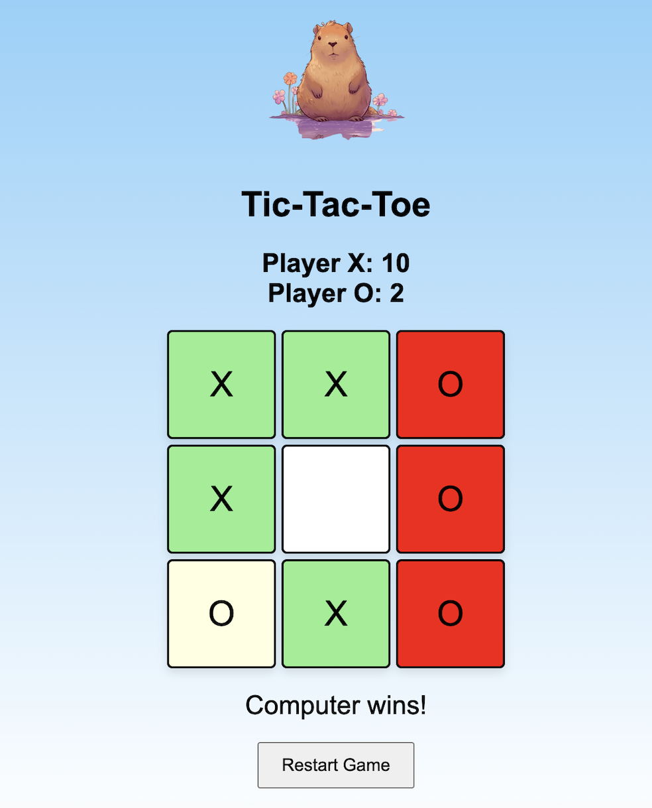

# My Design System

This repository documents the design system for our game.

[Design System](docs/design_system.md)

Github Repository Link
[Github Repository Link](https://github.com/kyu065/yatzy)

## How The Game Works
Try to connect three x in a row before your opponent does. Players may place their respective x or o in any space not yet taken by another player.

## Game States
- New game
- Player wins
- Computer wins
- Draw

## Game State Images:

### Start State

### Player win State

### Computer win State

### Draw State

## Contributors
- Kevin Yu - 300230560
- Eric Kwak - 300264568
