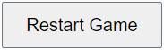

# Tic Tac Toe Game System Design

**Author:** Eric Kwak, Kevin Yu
**Date:** June 19, 2024
**Version:** 1.0
**Status:** Final

# Design System 

This document outlines the design system for the project. 

## Fonts 

- **Primary Font:** Arial, sans-serif
is the primary font used in the Tic-Tac-Toe game. This font is chosen for its simplicity and readability, ensuring a clean and user-friendly interface.

## Colours 
The game employs a minimalist color scheme:
- **Background Colour:** `#87cefa` - A light sky blue that provides a light backdrop, vertically gradients to '#ffffff' for flexibility.
- **Board Colour:** `#ffffff` - White cells for a clean look.
- **Cell Border Colour:** `#000000` - Black borders to clearly define each cell.
- **Cell Hover Colour:** `#c9d3d3` - Gray hover color to focus cell hovering and create interaction.
- **Cell Hover Shadow:** `#465d6280` and inset color of `#519aac` - Light shadows to create intensity and indiciation. 
- **Player X Cell Colour:** `#90EE90` - Light green indicating Player X.
- **Player O Cell Colour:** `#FFFFE0` - Light yellow indicating Player O.
- **Winner Animation Colours:** Red, Green, Blue - Flashing colours to highlight the winning cells.

## Game Components - Board and Game Controls

### Board
The board consists of a, with each cell measuring 100px by 100px and a 5px gap between cells. Cells change colour based on the player (green for X, yellow for O) and feature a flashing animation for the winning combination.

### Header
The header at the top of the games interface

- **Background Colour:** `#ffffff`
- **Text Colour:** `#000000`
- **Font Size:** 1.25rem
- **Alignment:** Center

### Footer
The footer at the bottom of the games interface

- **Background Colour:** `#87cefa`
- **Text Colour:** `#000000`
- **Font Size:** 1rem
- **Alignment:** Center

### Additional Elements ###

### Result_Display
 Shows game outcomes, styled with a font size of 1.5rem.

### Restart Button 
 Allows players to reset the game, styled with padding and a cursor pointer for better interaction.

#### Counter
 Allows the player to see the score record between both player and computer.

 

#### Image
 Acts as a visual element to enhance the visual appeal of the game interface, has a width of 150px and relative auto sized height. 

### Game State Screenshots

### Start State

### Player win State

### Computer win State

### Draw State

